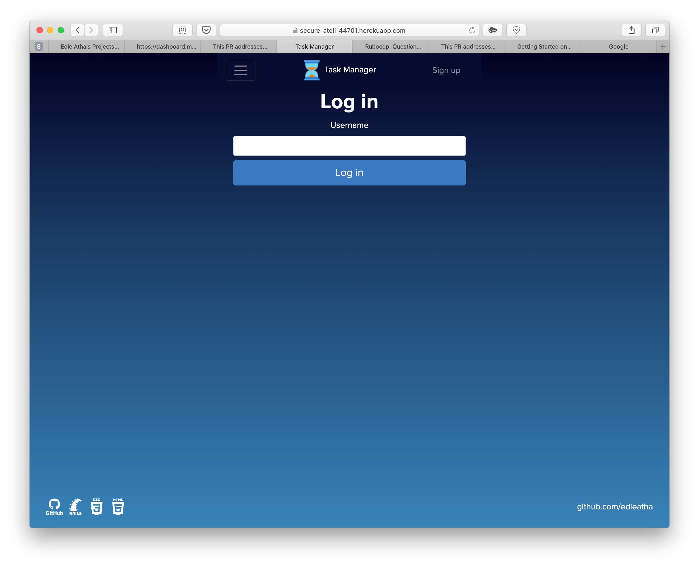
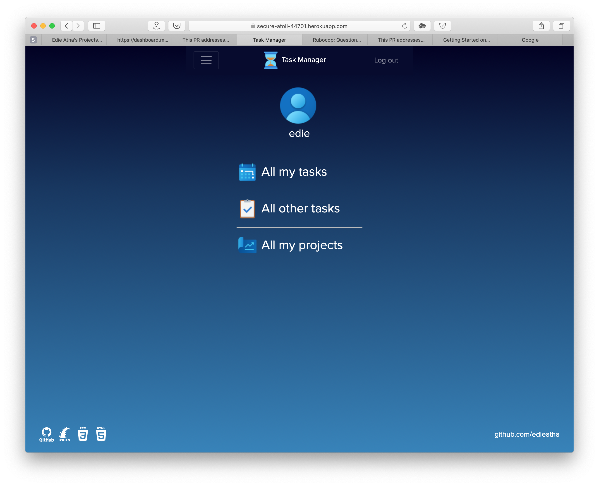
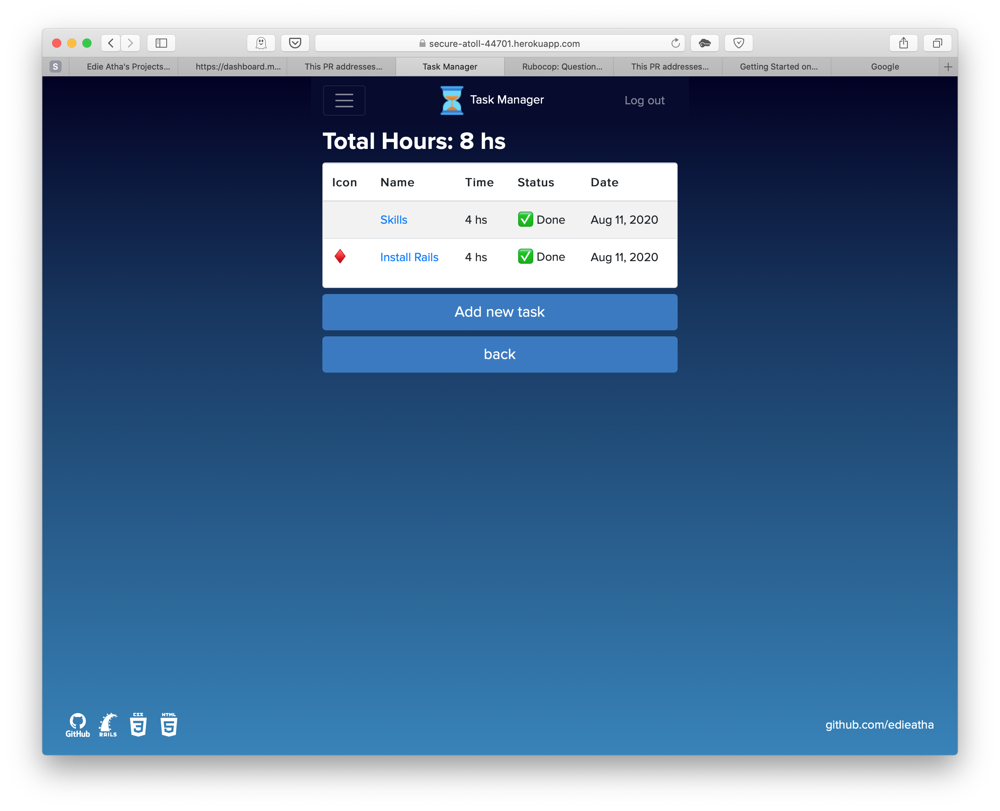
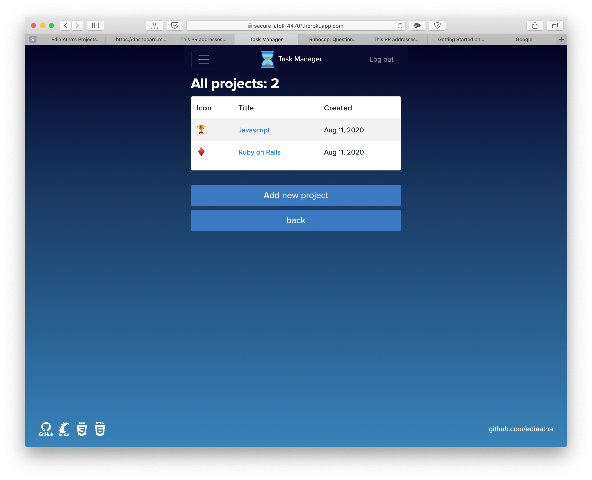
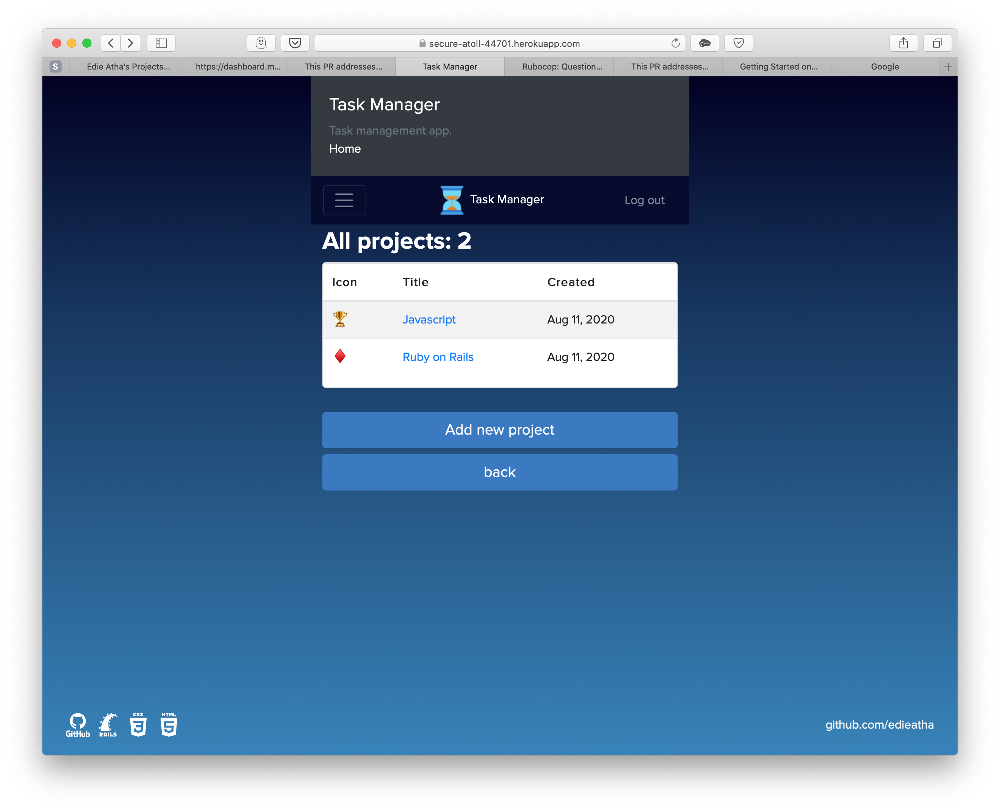

# Project Hours for Task Manager app with Ruby on Rails

> This repo includes code for a Task Manager app built with rails. One can track hours spent on a task and group the tasks 
> based on the projects.

## Extra Feature
> The added feature includes selection of task status (Done, Pending, and complete)

## Built With

- Ruby v2.7.0
- Ruby on Rails v5.2.4

## Live Demo

[Live Demo Link](https://secure-atoll-44701.herokuapp.com)








## Getting Started

To get a local copy up and running follow these simple example steps.

### Prerequisites

Ruby: 2.6.3
Rails: 5.2.3
Postgres: >=9.5

### Setup

Instal gems with:

```
bundle install
```

Setup database with:

```
   rails db:create
   rails db:migrate
```


### Usage

Start server with:

```
    rails server
```

Open `http://localhost:3000/` in your browser.

### Run tests

```
    rpsec --format documentation
```

### Deployment

`Heroku`

## Authors

👤 **Edie Atha**

- Github: [@edieatha](https://github.com/edieatha)
- Twitter: [@edieatha](https://twitter.com/edieatha)
- Linkedin: [linkedin](https://www.linkedin.com/in/edieatha/)
 Email: [email](edieatha@gmail.com)


## 🤝 Contributing

Contributions, issues and feature requests are welcome!

Feel free to check the [issues page](https://github.com/edieatha/project-hours/issues).


## Acknowledgments

* [Microverse](https://www.microverse.org/)
 > Design given by: [@Gregoire Vella on Behance](https://www.behance.net/gregoirevella)

## 📝 License

This project is [MIT](lic.url) licensed.

## Show your support

Give a ⭐️ if you like this project!


